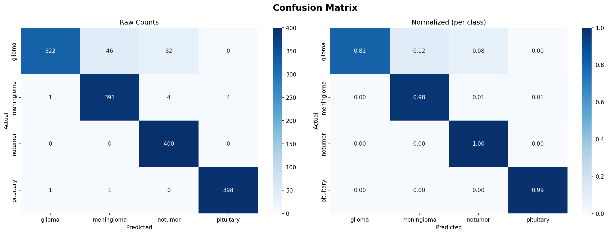
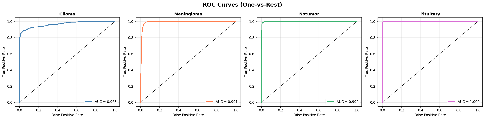
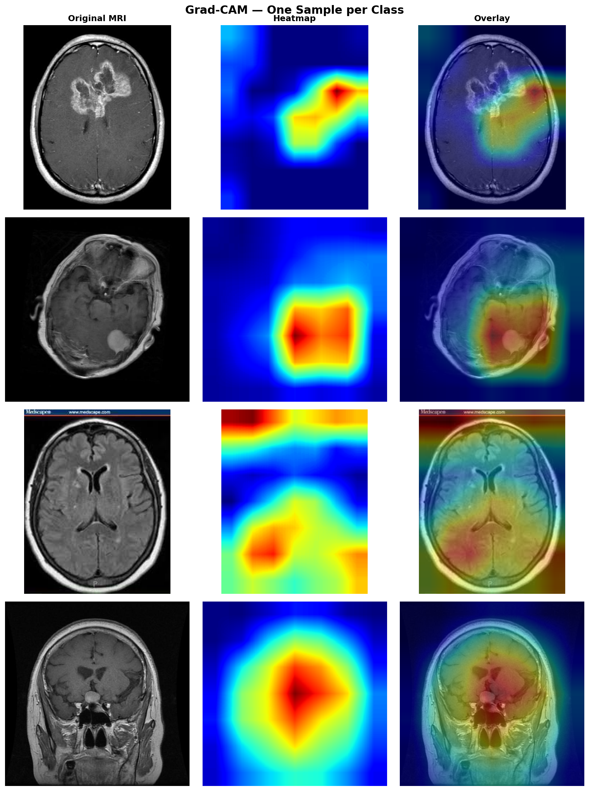

# Brain Tumor Detection from MRI

I developed a brain tumor classification system achieving 94.44% accuracy, iterating through multiple architectures before identifying ResNet50 as the optimal solution.

A deep learning web application that classifies brain tumors from MRI scans into 4 categories using a fine-tuned ResNet50 model. The app includes Grad-CAM visualizations to highlight the regions of the MRI that influenced the model's prediction.


---

## Introduction

Brain tumor detection from MRI scans is a critical task in medical imaging. This project builds an end-to-end deep learning pipeline that:

- Classifies MRI scans into 4 categories: **Glioma**, **Meningioma**, **No Tumor**, and **Pituitary**
- Achieves **94.44% test accuracy** using transfer learning with ResNet50
- Provides **Grad-CAM heatmaps** so predictions are explainable and not a black box
- Wraps everything in an interactive **Streamlit web app** for easy use

---

## Motivation

Brain tumors are life-threatening because they directly impact the brain, leading to loss of motor control, personality changes, and cognitive decline. I chose to build an AI system for brain tumor detection to assist doctors in improving diagnostic accuracy while allowing them to focus on complex decision-making.

But beyond the technical challenge, this project went through multiple iterations — from 84% to 87% to finally 94.44% accuracy — because I refused to settle for a result I wasn't confident in. In medical AI, the standard has to be higher. I hope this work reflects that commitment.

## Dataset

**Source:** [Kaggle — Brain Tumor MRI Dataset by Masoud Nickparvar](https://www.kaggle.com/datasets/masoudnickparvar/brain-tumor-mri-dataset)

| Split | Images |
|-------|--------|
| Training | 5,600 |
| Testing | 1,600 |
| **Total** | **7,200** |

| Class | Description | Severity |
|-------|-------------|----------|
| Glioma | Tumor in the brain/spinal cord glial cells | High |
| Meningioma | Tumor in the meninges membranes | Moderate |
| No Tumor | Normal MRI with no abnormal growth | None |
| Pituitary | Tumor in the pituitary gland | Moderate |

---

## Model Architecture

**Base Model:** ResNet50 pretrained on ImageNet

**Fine-tuning strategy:**
- All layers frozen except `layer4` (fine-tuned at `lr = 1e-5`)
- Custom classifier head trained from scratch (at `lr = 1e-4`)

**Custom classifier head:**
```
Dropout(0.5) → Linear(2048, 256) → ReLU → Dropout(0.5) → Linear(256, 4)
```

**Training setup:**

| Parameter | Value |
|-----------|-------|
| Epochs | 16 |
| Batch size | 32 |
| Optimizer | Adam (weight decay = 1e-4) |
| Loss function | CrossEntropyLoss (class-weighted) |
| LR scheduler | StepLR (step=10, gamma=0.1) |
| Image size | 224 × 224 |
| Device | CUDA / CPU |

**Data augmentation (training only):**
- Random horizontal flip
- Random rotation (±10°)
- Color jitter (brightness, contrast, saturation, hue)
- Random affine shear

---

## Results

| Metric | Score |
|--------|-------|
| Test Accuracy | **94.44%** |

### Confusion Matrix


### ROC Curves


### Grad-CAM Explainability


---

## Project Structure

```
brain-tumor-detection/
│
├── data/
│   ├── training/
│   │   ├── glioma/
│   │   ├── meningioma/
│   │   ├── notumor/
│   │   └── pituitary/
│   └── testing/
│       ├── glioma/
│       ├── meningioma/
│       ├── notumor/
│       └── pituitary/
│
├── models/
│   └── best_model.pth
│
├── notebooks/
│   ├── 01_eda.ipynb
│   ├── 02_training.ipynb
│   ├── 03_evaluation.ipynb
│   └── 04_gradcam.ipynb
│
├── results/
│   ├── confusion_matrix.png
│   ├── confidence_distribution.png
│   ├── misclassified.png
│   ├── roc_curves.png
│   ├── training_history.png
│   ├── gradcam_all_classes.png
│   └── gradcam_multi_sample.png
│
├── src/
│   ├── train.py
│   ├── predict.py
│   ├── gradcam.py
│   └── app.py
│
├── .gitignore
├── requirements.txt
└── README.md
```

---

## Installation

**1. Clone the repository**
```bash
git clone https://github.com/nadim-hamade/brain-tumor-detection.git
cd brain-tumor-detection
```

**2. Install dependencies**
```bash
pip install -r requirements.txt
```

**3. Download the dataset** from [Kaggle](https://www.kaggle.com/datasets/masoudnickparvar/brain-tumor-mri-dataset) and place it under `data/` following the structure above.

---

## Usage

**Train the model**
```bash
cd src
python train.py
```

**Run predictions**
```bash
cd src
python predict.py
```

**Generate Grad-CAM visualizations**
```bash
cd src
python gradcam.py
```

**Launch the web app**
```bash
streamlit run src/app.py
```

---

## Grad-CAM Explainability

This project uses **Gradient-weighted Class Activation Mapping (Grad-CAM)** to make predictions interpretable. Grad-CAM uses the gradients flowing into `layer4` of ResNet50 to produce a heatmap showing which regions of the MRI the model focused on when making its prediction.

This is especially important in medical AI — a correct prediction for the wrong reason is not trustworthy.

---

## Disclaimer

This tool is for **educational purposes only** and should not be used as a substitute for professional medical diagnosis. Always consult a qualified medical professional for any health concerns.

---

## Developer

**Nadim Hamade**

- Built with PyTorch, Streamlit, and scikit-learn
- Transfer learning from ImageNet pretrained ResNet50
- Grad-CAM implementation from scratch
- Developed as a university project
